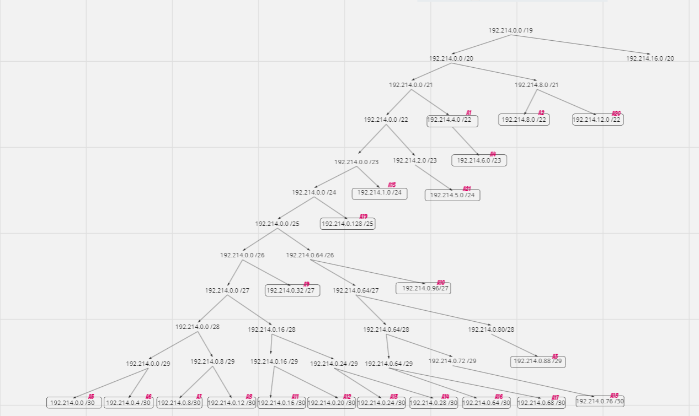
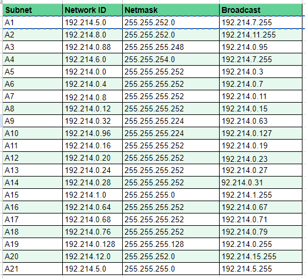
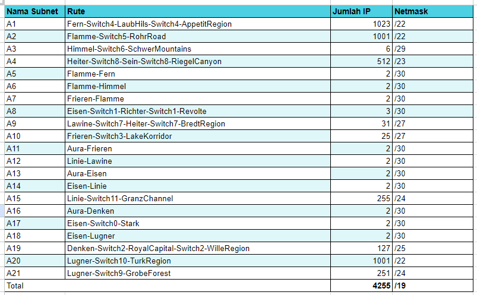
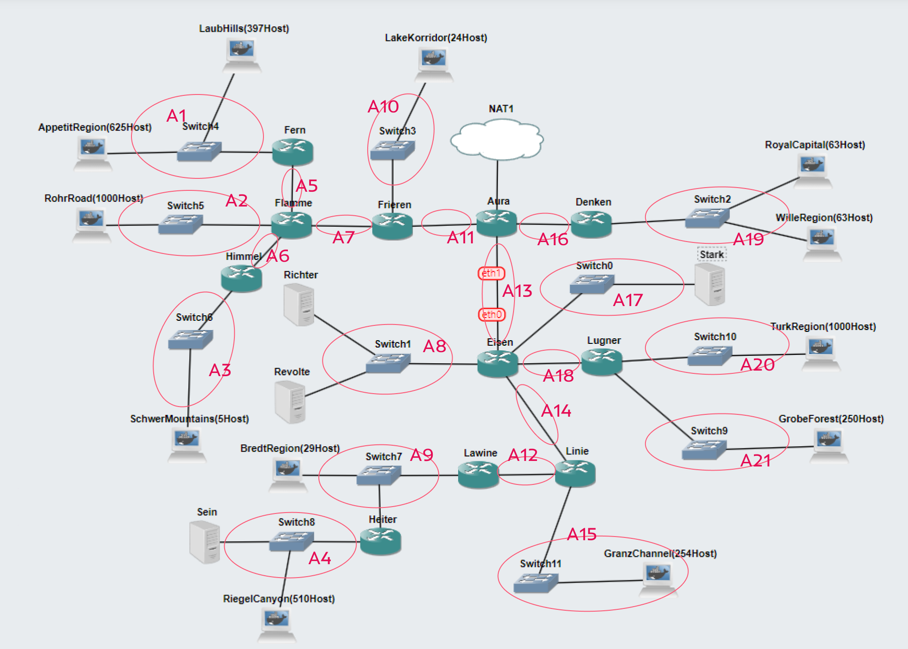
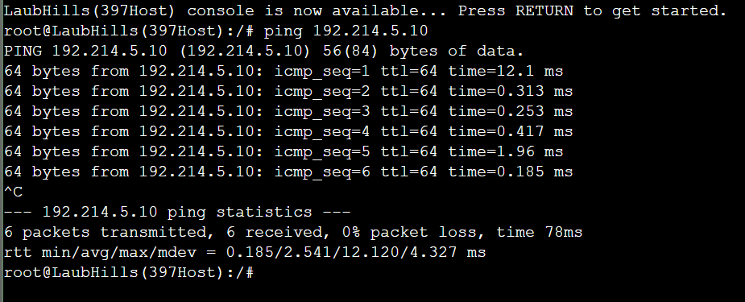
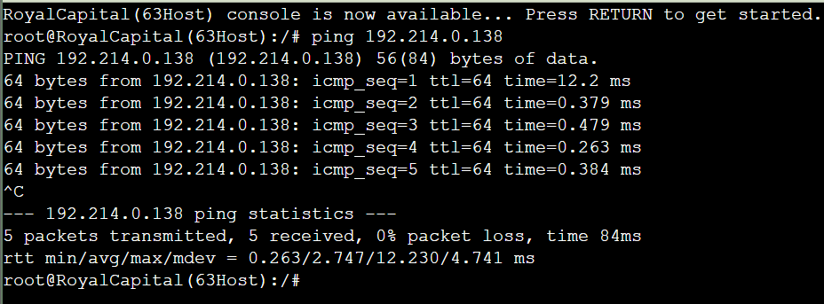

# Jarkom-Modul-4-E16-2023
Laporan Praktikum Jaringan Komputer Modul 4 Tahun 2023

## Anggota Kelompok

| NRP        | Nama                 |
| ---        | ---                  |
| 5025211058 | Nadya Zuhria Amana   |
| 5025211127 | Nadif Mustafa        |

## Daftar Isi
- [Jarkom-Modul-4-E16-2023](#jarkom-modul-4-e16-2023)
  - [Anggota Kelompok](#anggota-kelompok)
  - [Daftar Isi](#daftar-isi)
  - [VLSM](#vlsm)
    - [Konfigurasi GNS3](#konfigurasi-gns3)
    - [Routing](#routing)
        - [Denken](#denken)
        - [Lugner](#lugner)
        - [Linie](#linie)
        - [Lawine](#lawine)
        - [Heiter](#heiter)
        - [Himmel](#himmel)
        - [Flamme](#flamme)
        - [Fern](#fern)
        - [FRIEREN](#frieren)
        - [EISEN](#eisen)
        - [AURA](#aura)
  - [CIDR](#cidr)
    - [Topologi CPT](#topologi-cpt)
    - [Penggabungan Subnet](#penggabungan-subnet)
    - [Tree](#tree)
    - [Pembagian IP](#pembagian-ip)
    - [Testing](#testing)

## VLSM

### Tree



### Pembagian IP



### Subnetting





### Konfigurasi GNS3

- ROYAL CAPITAL 
```
#A19
auto eth0
iface eth0 inet static
address 192.214.0.133
netmask 255.255.255.128
gateway 192.214.0.129
```

- WILLE REGION
```
#A19
auto eth0
iface eth0 inet static
address 192.214.0.138
netmask 255.255.255.128
gateway 192.214.0.129
```


- DENKEN
```
auto lo
iface lo inet loopback

#A16 (Aura)
auto eth0
iface eth0 inet static
address 192.214.0.66
netmask 255.255.255.252
gateway 192.214.0.65

#A19 (Switch 2)
auto eth1
iface eth1 inet static
address 192.214.0.129
netmask 255.255.255.128
```

- AURA
```
auto lo
iface lo inet loopback

auto eth0
iface eth0 inet dhcp

#A13
auto eth1
iface eth1 inet static
	address 192.214.0.25
	netmask 255.255.255.252

#A16
auto eth2
iface eth2 inet static
	address 192.214.0.65
	netmask 255.255.255.252

#A11
auto eth3
iface eth3 inet static
	address 192.214.0.17
	netmask 255.255.255.252
```

- FRIEREN
```
auto lo
iface lo inet loopback

#A11
auto eth0
iface eth0 inet static
address 192.214.0.18
netmask 255.255.255.252
gateway 192.214.0.17

#A10
auto eth1
iface eth1 inet static
address 192.214.0.97
netmask 255.255.255.224

#A7
auto eth2
iface eth2 inet static
address 192.214.0.9
netmask 255.255.255.252
```

- LakeKorridor(24 Host)
```
#A10
auto eth0
iface eth0 inet static
address 192.173.0.101
netmask 255.255.255.224
gateway 192.173.0.97
```

- FLAMME
```
auto lo
iface lo inet loopback

#A7
auto eth0
iface eth0 inet static
address 192.214.0.10
netmask 255.255.255.252
gateway 192.214.0.9

#A5
auto eth1
iface eth1 inet static
address 192.214.7.129
netmask 255.255.255.252

#A2
auto eth2
iface eth2 inet static
address 192.214.8.1
netmask 255.255.252.0

#A6
auto eth3
iface eth3 inet static
address 192.214.0.5
netmask 255.255.255.252
```

- FERN
```
auto lo
iface lo inet loopback

#A5
auto eth0
iface eth0 inet static
address 192.214.0.2
netmask 255.255.255.252
gateway 192.214.0.1

#A1
auto eth1
iface eth1 inet static
address 192.214.5.1
netmask 255.255.248.0
```

- LaubHills(397Host)
```
#A1
auto eth0
iface eth0 inet static
address 192.214.5.5
netmask 255.255.252.0
gateway 192.214.5.1
```

- AppetitRegion(625Host)
```
#A1
auto eth0
iface eth0 inet static
address 192.214.5.10
netmask 255.255.252.0
gateway 192.214.5.1
```

- RohrRoad(1000Host)
```
#A2
auto eth0
iface eth0 inet static
address 192.214.8.5
netmask 255.255.252.0
gateway 192.214.8.1
```

- HIMMEL
```
auto lo
iface lo inet loopback

#A6
auto eth0
iface eth0 inet static
address 192.214.0.9
netmask 255.255.255.252
gateway 192.214.0.5

#A3
auto eth1
iface eth1 inet static
address 192.214.0.89
netmask 255.255.255.248
```

- SchwerMountains(5Host)
```
#A3
auto eth0
iface eth0 inet static
address 192.214.0.93
netmask 255.255.255.248
gateway 192.214.0.89
```

- EISEN
```
auto lo
iface lo inet loopback

#A13
auto eth0
iface eth0 inet static
address 192.214.0.26
netmask 255.255.255.252
gateway 192.214.0.25

#A17
auto eth1
iface eth1 inet static
address 192.214.0.69
netmask 255.255.255.252

#A8
auto eth2
iface eth2 inet static
address 192.214.0.13
netmask 255.255.255.252

#A18
auto eth3
iface eth3 inet static
address 192.214.0.77
netmask 255.255.255.252

#A14
auto eth4
iface eth4 inet static
address 192.214.0.29
netmask 255.255.255.252
```

- STARK
```
#A17
auto eth0
iface eth0 inet static
address 192.214.0.70
netmask 255.255.255.252
gateway 192.214.0.69
```

- LUGNER
```
auto lo
iface lo inet loopback

#A18
auto eth0
iface eth0 inet static
address 192.214.0.78
netmask 255.255.255.252
gateway 192.214.0.77

#A20
auto eth1
iface eth1 inet static
address 192.214.12.1
netmask 255.255.252.0

#A21
auto eth2
iface eth2 inet static
address 192.214.5.1
netmask 255.255.255.0
```

- TurkRegion(1000Host)
```
#A20
auto eth0
iface eth0 inet static
address 192.214.12.5
netmask 255.255.252.0
gateway 192.214.12.1
```

- GrobeForest(250Host)
```
#A21
auto eth0
iface eth0 inet static
address 192.214.5.5
netmask 255.255.255.0
gateway 192.214.5.1
```

- RICHTER
```
#A8
auto eth0
iface eth0 inet static
address 192.214.0.14
netmask 255.255.255.252
gateway 192.214.0.13
```

- REVOLTE
```
#A8
auto eth0
iface eth0 inet static
address 192.214.0.15
netmask 255.255.255.252
gateway 192.214.0.13
```

- LINIE
```
auto lo
iface lo inet loopback

#A14
auto eth0
iface eth0 inet static
address 192.214.0.30
netmask 255.255.255.252
gateway 192.214.0.29

#A12
auto eth1
iface eth1 inet static
address 192.214.0.21
netmask 255.255.255.252

#A15
auto eth2
iface eth2 inet static
address 192.214.1.0
netmask 255.255.255.0
```

- GRANZCHANNEL
```
#A15
auto eth0
iface eth0 inet static
address 192.214.1.5
netmask 255.255.255.0
gateway 192.214.1.1
```

- LAWINE
```
auto lo
iface lo inet loopback

#A12
auto eth0
iface eth0 inet static
address 192.214.0.22
netmask 255.255.255.252
gateway 192.214.0.21

#A9
auto eth1
iface eth1 inet static
address 192.214.0.33
netmask 255.255.255.224
```

- BredtRegion
```
#A9
auto eth0
iface eth0 inet static
address 192.214.0.37
netmask 255.255.255.224
gateway 192.214.0.33
```

- HEITER
```
auto lo
iface lo inet loopback

#A9
auto eth0
iface eth0 inet static
address 192.214.0.34
netmask 255.255.255.224
gateway 192.214.0.33

#A4
auto eth1
iface eth1 inet static
address 192.214.6.1
netmask 255.255.254.0
```

- SEIN
```
#A4
auto eth0
iface eth0 inet static
address 192.214.6.2
netmask 255.255.254.0
gateway 192.214.6.1
```

- RIEGEL CANYON
```
#A4
auto eth0
iface eth0 inet static
address 192.214.6.7
netmask 255.255.254.0
gateway 192.214.6.1
```

### Routing

##### Denken 
```
route add -net 0.0.0.0 netmask 0.0.0.0 gw 192.214.0.65
```

##### Lugner 
```
route add -net 0.0.0.0 netmask 0.0.0.0 gw 192.173.0.77
```

##### Linie
```
#A9
route add -net 192.214.0.32 netmask  255.255.255.224 gw  192.214.0.21
#A4
route add -net 192.214.6.0 netmask 255.255.254.0 gw  192.214.0.21
```

##### Lawine
```
route add -net 192.214.6.0 netmask 255.255.254.0 gw 192.214.0.33
```

##### Heiter
```
route add -net 0.0.0.0 netmask 0.0.0.0 gw 192.214.0.21
```

##### Himmel
```
route add -net 0.0.0.0 netmask 0.0.0.0 gw 192.214.0.9
```

##### Flamme
```
#A1
route add -net 192.214.5.0 netmask 255.255.252.0 gw 192.214.0.1
#A3
route add -net 192.214.0.88 netmask 255.255.255.248 gw 192.214.0.5
```

##### Fern
```
route add -net 0.0.0.0 netmask 0.0.0.0 gw 192.214.0.9
```

##### FRIEREN
```
#A5
route add -net 192.214.0.0 netmask 255.255.255.252 gw 192.214.0.9
#A1
route add -net 192.214.5.0 netmask 255.255.252.0 gw 192.214.0.9
#A2
route add -net 192.214.8.0 netmask 255.255.252.0 gw 192.214.0.9
#A6
route add -net 192.214.0.4 netmask 255.255.255.252 gw 192.214.0.9
#A3
route add -net 192.214.0.88 netmask 255.255.255.248 gw 192.214.0.9
```

##### EISEN
```
#A20
route add -net 192.214.12.0 netmask 255.255.252.0 gw 192.214.0.77
#A21
route add -net 192.214.5.0 netmask 255.255.255.0 gw 192.214.0.77

#A15
route add -net 192.214.1.0 netmask 255.255.255.0 gw 192.214.0.29
#A12
route add -net 192.214.0.20 netmask 255.255.255.252 gw 192.214.0.29
#A9
route add -net 192.214.0.32 netmask 255.255.255.224 gw 192.214.0.29
#A4
route add -net 192.214.6.0 netmask 255.255.255.252 gw 192.214.0.29
```

##### AURA
```
Frieren
#A10
route add -net 192.214.0.96 netmask 255.255.255.224 gw 192.214.0.17
#A7
route add -net 192.214.0.8 netmask 255.255.255.252 gw 192.214.0.17
#A5
route add -net 192.214.0.0 netmask 255.255.255.252 gw 192.214.0.17
#A1
route add -net 192.214.5.0 netmask 255.255.252.0 gw 192.214.0.17
#A2
route add -net 192.214.8.0 netmask 255.255.252.0 gw 192.214.0.17
#A6
route add -net 192.214.0.4 netmask 255.255.255.252 gw 192.214.0.17
#A3
route add -net 192.214.0.88 netmask 255.255.255.248 gw 192.214.0.17

- Denken
route add -net 192.214.0.128 netmask 255.255.255.128 gw 192.214.0.65

- Eisen
#A17
route add -net 192.214.0.68 netmask 255.255.255.252 gw 192.214.0.25
#A18
route add -net 192.214.0.76 netmask 255.255.255.252 gw 192.214.0.25
#A20
route add -net 192.214.12.0 netmask 255.255.252.0 gw 192.214.0.25
#A21
route add -net 192.214.5.0 netmask 255.255.255.0 gw 192.214.0.25
#A14
route add -net 192.214.0.28 netmask 255.255.255.252 gw 192.214.0.25
#A15
route add -net 192.214.1.0 netmask 255.255.254.0 gw 192.214.0.25
#A12
route add -net 192.214.0.20 netmask 255.255.255.252 gw 192.214.0.25
#A9
route add -net 192.214.0.32 netmask 255.255.255.224 gw 192.214.0.25
#A4
route add -net 192.214.6.0 netmask 255.255.254.0 gw 192.214.0.25
#A8
route add -net 192.214.0.12 netmask 255.255.255.252 gw 192.214.0.25
```

### Testing




## CIDR

### Topologi CPT


### Penggabungan Subnet

Kondisi awal **(A)**


Penggabungan pertama **(B)**


Penggabungan kedua **(C)**


Penggabungan ketiga **(D)**


Penggabungan keempat **(E)**


Penggabungan kelima **(F)**


Penggabungan keenam **(G)**


Penggabungan ketujuh **(H)**


Penggabungan terakhir **(I)**


### Tree


### Pembagian IP


### Testing


